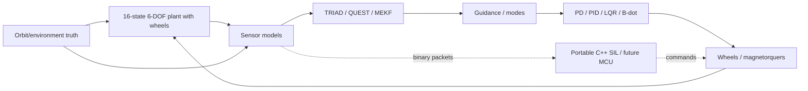
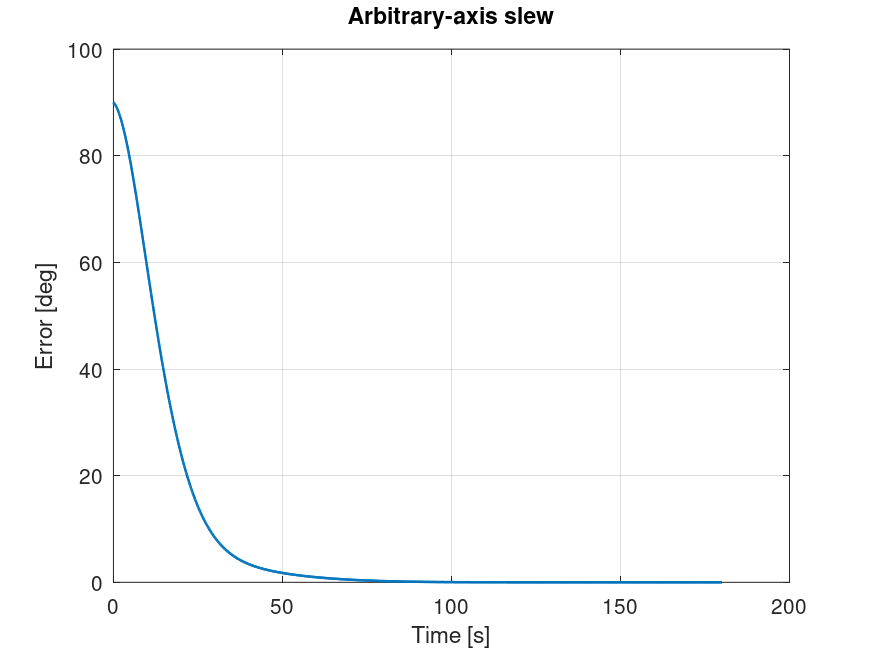
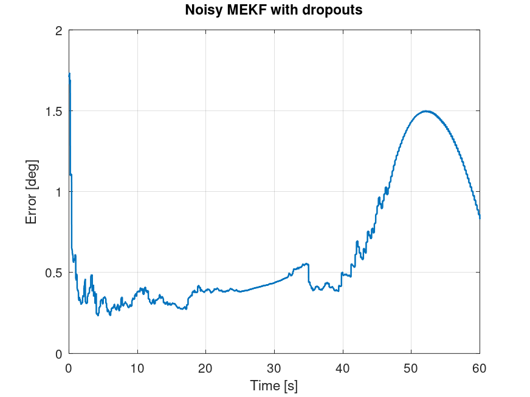
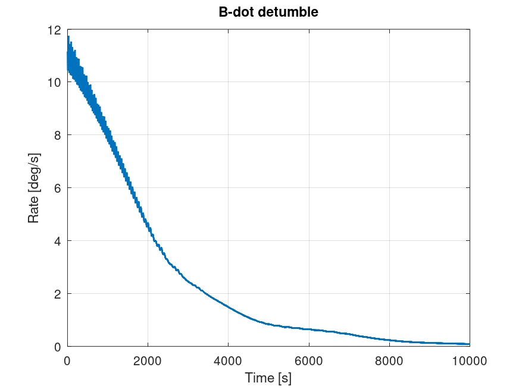
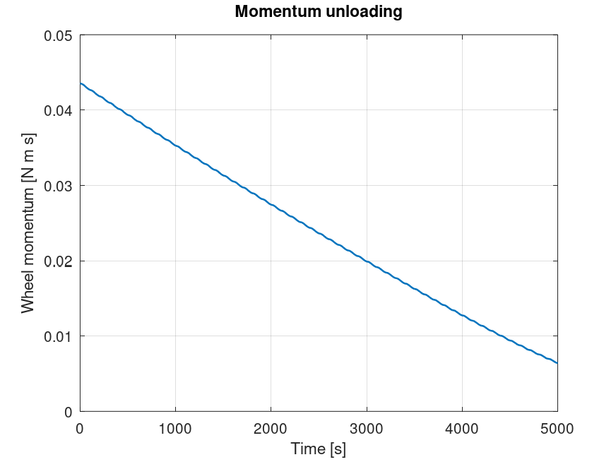
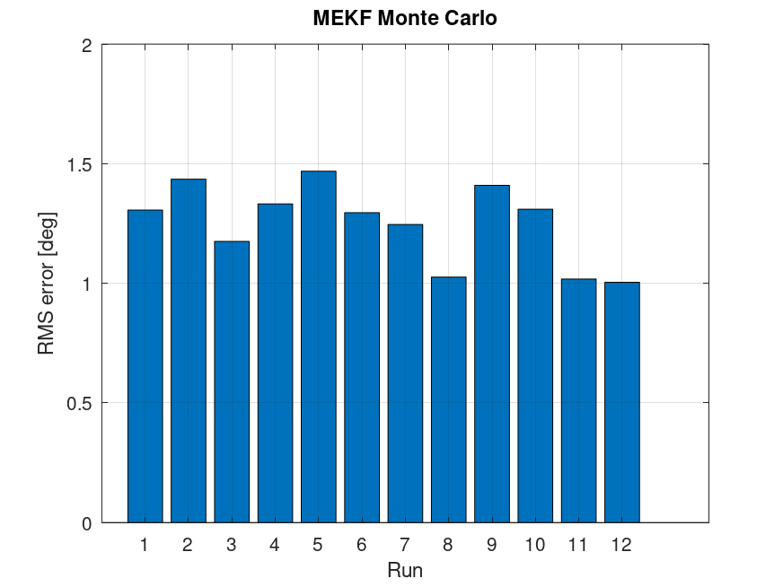

# CubeSat ADCS Digital Twin and Flight-Software Reference

A research-grade, reproducible 3U CubeSat attitude determination and control
reference. It combines a MATLAB/Octave six-degree-of-freedom truth model,
flight-like sensors, estimation, guidance/control, magnetic momentum
management, deterministic modes, and a portable C++ HIL/SIL boundary.

The software is numerically verified. It is not flight-qualified, calibrated
to selected hardware, or physically HIL-tested.

## Architecture



The executable closed-loop path and its truth/flight boundary are documented
in [`docs/INTEGRATED_DIGITAL_TWIN.md`](docs/INTEGRATED_DIGITAL_TWIN.md).

Truth is visible only to plant, sensor-generation, and metric code. Estimators
receive measurements/reference vectors; controllers receive estimates and
guidance references.

## Capabilities

- Scalar-first Hamilton `q_IB`, quaternion algebra, and DCMs.
- Torque-free rigid body, wheel momentum exchange, and actuator limits.
- ECI two-body/J2 orbit, coupled 13-state validation plant, and closed-loop
  16-state 6-DOF/wheel propagation.
- Gravity gradient, drag/aerodynamic torque, Sun/eclipse, solar pressure, and
  centered-dipole magnetic field.
- Gyro, magnetometer, coarse Sun, GPS, and optional star tracker with
  calibration errors, noise, random walk, sampling, saturation, and dropout.
- TRIAD, Davenport q-method/QUEST, and gyro-bias MEKF.
- Inertial, Sun/safe, nadir/LVLH, and smooth slew guidance.
- Quaternion PD, bounded integral comparison, and CARE-derived LQR.
- Three-axis magnetorquers, B-dot detumble, and wheel desaturation.
- Initialization, detumble, safe, nominal, slew, desaturation, and fault modes.
- CRC-protected binary protocol, timing contract, CMake, and native host SIL.

## Quick start

Requirements: GNU Octave 8+ or MATLAB, CMake 3.16+, and a C++17 compiler.

Run all MATLAB/Octave tests:

```bash
for test_file in matlab/tests/test*.m; do octave --quiet "$test_file" || exit 1; done
```

Build and test native SIL:

```bash
cmake -S . -B build -DCMAKE_BUILD_TYPE=Release
cmake --build build --parallel
ctest --test-dir build --output-on-failure
```

Generate final verification tables and plots:

```bash
octave --quiet --eval 'addpath(genpath("matlab")); runProjectVerification("artifacts/verification");'
```

Expected summary: `PROJECT VERIFICATION COMPLETE: 15 checks, Monte Carlo pass
100%`. Recorded results are in
[`verification_results.csv`](artifacts/verification/verification_results.csv).

Run the complete estimator-in-the-loop campaign:

```bash
octave --quiet --eval 'addpath(genpath("matlab")); runIntegratedAdcsCampaign("artifacts/integration");'
```

## Demonstrations

Use `addpath(genpath("matlab"))`, then run:

| Demo | Command |
|---|---|
| Torque-free invariants | `runTorqueFreeRotation` |
| Reaction-wheel exchange | `runReactionWheelTest` |
| Principal/arbitrary slews | `runAttitudeSlewSuite` |
| Orbit / full 6-DOF | `runOrbitValidation`, `run6DOFValidation` |
| Noisy MEKF/dropouts | `runMekfValidation` |
| B-dot detumble | `simulateBdotDetumble()` |
| Nadir/LVLH | `runNadirPointingDemo()` |
| Wheel unloading | `simulateMomentumUnloading()` |
| PD/PID/LQR | `runControllerComparison` |
| Monte Carlo/fault | `runMonteCarloVerification(12)`, `runFaultScenario()` |
| Full integrated loop | `runIntegratedAdcsCampaign("artifacts/integration")` |

## Final evidence

| Figure | Purpose |
|---|---|
|  | Arbitrary-axis slew |
|  | Noisy MEKF with outages |
|  | Magnetic detumble |
|  | Wheel unloading |
|  | Twelve seeded MEKF runs |

Thresholds, metrics, and requirement traceability are in
[`docs/VERIFICATION.md`](docs/VERIFICATION.md).

## Documentation

- [Conventions](matlab/CONVENTIONS.md)
- [Attitude-control theory](docs/ATTITUDE_CONTROL.md)
- [Orbit/environment/6-DOF theory](docs/SPACE_ENVIRONMENT.md)
- [Sensors and estimation theory](docs/SENSORS_AND_ESTIMATION.md)
- [Guidance/control/modes](docs/GUIDANCE_CONTROL.md)
- [HIL architecture, protocol, timing, MCU plan](docs/HIL_ARCHITECTURE.md)
- [Verification matrix](docs/VERIFICATION.md)
- [Status](docs/STATUS.md) and [roadmap](docs/ROADMAP.md)

All dynamics use SI. `q_IB=[qw qx qy qz]^T` rotates body components into ECI.
Angular rate is body relative to inertial, expressed in body.

## Repository layout

```text
matlab/config        parameters
matlab/math          quaternion/linear algebra
matlab/dynamics      attitude, actuators, orbit, 6-DOF plant
matlab/environment   independent environment models
matlab/sensors       truth-to-measurement boundary
matlab/estimation    TRIAD, QUEST, MEKF
matlab/guidance      pointing and slew references
matlab/control       feedback, magnetic control, allocation, modes
matlab/simulations   demonstrations and final campaign
matlab/tests         regression suite
cpp/include/adcs     portable protocol, timing, control reference
cpp/tests            native SIL
docs                 theory, architecture, verification, status
artifacts            generated final evidence
```

## Known limitations

- Environment models are engineering fidelity, not operational ephemeris,
  NRLMSISE, or IGRF implementations.
- Spacecraft, sensor, wheel, and rod parameters are assumptions rather than
  measurements from selected hardware.
- MEKF references do not include full navigation/environment uncertainty.
- C++ covers quaternion/frame math, QUEST/MEKF, guidance, PD/LQR, wheel
  allocation, modes, configuration/interfaces, protocol, and timing. The
  environment and truth plant intentionally remain MATLAB/Octave simulation
  code rather than flight code.
- No Simulink, real-time target, processor-in-loop, physical HIL, environmental
  qualification, or on-orbit test has been executed.
- Twelve-run Monte Carlo is regression evidence, not mission reliability proof.

## Future work

1. Select hardware and replace assumptions with traced/calibrated values.
2. Connect the portable C++ flight core to a timed processor/serial SIL target.
3. Add transport fuzzing, command-timeout tests, WCET/stack measurements, and
   processor-in-loop serial loopback.
4. Execute staged physical HIL and record board, firmware, wiring, loads,
   calibration, timing, and raw data.
5. Increase environment fidelity and expand sensitivity/fault campaigns where
   mission requirements justify it.

## References

1. J. R. Wertz, *Spacecraft Attitude Determination and Control*, 1978.
2. F. L. Markley and J. L. Crassidis, *Fundamentals of Spacecraft Attitude
   Determination and Control*, 2014.
3. B. Wie, *Space Vehicle Dynamics and Control*, 2nd ed., 2008.
4. M. D. Shuster and S. D. Oh, “Three-Axis Attitude Determination from Vector
   Observations,” 1981.
5. NASA, *General Mission Analysis Tool Mathematical Specifications*.
6. CCSDS telemetry and channel-coding recommendations for future mission links.
7. ARM CMSIS and the selected MCU reference manual for target integration.

## License

No license file is currently provided. Establish reuse terms with the owner
before redistribution.
