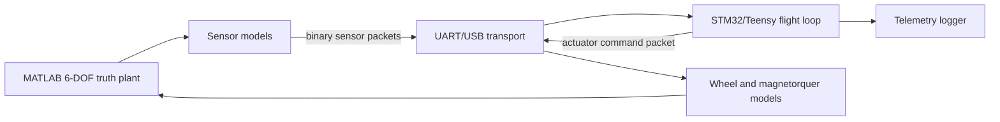

# HIL-Ready Architecture and Interface Control Document

## Scope and evidence boundary

This repository defines a hardware-in-the-loop-ready boundary; it has not been
run on physical hardware. The executable evidence is host software-in-the-loop
(SIL). “HIL-ready” means deterministic packets, timing, units, error handling,
and a microcontroller integration plan exist and are testable before hardware
selection.

## Architecture

On hardware, the MATLAB plant and models remain on the host. The target runs
packet decode, sensor scheduling, MEKF, guidance, modes, control, allocation,
and command encode. For SIL, native code replaces the target/transport while
using the same structures and algorithms.

## Binary serial protocol, version 1

UART default is 921600 baud, 8-N-1; USB CDC is acceptable. Every little-endian
frame is `header | payload | crc32`. The packed 12-byte header contains:

| Field | Type | Meaning |
|---|---|---|
| sync | `uint16` | `0xA55A` |
| version | `uint8` | `1` |
| type | `uint8` | packet ID |
| payload_bytes | `uint16` | exact payload size |
| sequence | `uint16` | per-transmitter counter |
| timestamp_us | `uint32` | monotonic sample/command time, wraps safely |

CRC-32/ISO-HDLC (`0xEDB88320`, init/final XOR all ones) covers header bytes
starting at `version` and the payload; sync and CRC itself are excluded. A
receiver scans for sync, rejects unknown version/type/length, rejects bad CRC,
counts sequence gaps, and discards stale/out-of-order sensor timestamps.

Packet IDs and packed payloads are authoritative in `protocol.hpp`:

| ID | Packet | Payload and units |
|---:|---|---|
| 1 | IMU | gyro `float[3]` rad/s, magnetic field `float[3]` T, status bits |
| 2 | Sun | normalized body direction `float[3]`, valid byte |
| 3 | GPS | ECI position `double[3]` m, ECI velocity `float[3]` m/s, valid byte |
| 16 | Attitude | `q_IB[4]`, gyro bias rad/s, six covariance diagonals, mode/status |
| 32 | Actuator command | wheel torque N m, rod dipole A m², validity deadline |
| 48 | Heartbeat | implementation/build identity payload (target-defined) |

Quaternion, frame, and SI-unit conventions are never inferred from packet
context; they are fixed by version 1. Status bit assignments must be frozen in
the target-specific ICD before hardware testing.

## Timing contract

The monotonic 32-bit microsecond clock and unsigned subtraction are rollover
safe. Nominal tasks are gyro/MEKF 100 Hz, control 20 Hz, magnetometer/telemetry
10 Hz, Sun sensor 5 Hz, and GPS 1 Hz. Sensor timestamps describe acquisition,
not receipt. The estimator propagates once per gyro sample and applies vector
updates asynchronously. Commands expire; the actuator interface commands zero
after `command_valid_until_us` or after two missed control periods.

Budget each 10 ms frame as: acquisition/transport 2 ms, estimator 3 ms,
guidance/modes/control 2 ms, command transport 1 ms, 2 ms margin. Measure these
budgets on the selected MCU; they are requirements, not demonstrated results.

## STM32/Teensy-class integration plan

1. Select an MCU with hardware floating point, monotonic timer, two independent
   serial channels, watchdog, and enough RAM for fixed-size MEKF matrices.
2. Compile the portable C++17 core without dynamic allocation, exceptions in
   the real-time path, or OS dependencies. Keep HAL drivers outside `adcs`.
3. Use DMA ring buffers for serial RX/TX and parse complete CRC-checked frames
   outside interrupts. Interrupts only timestamp and move bytes/samples.
4. Schedule the 100 Hz gyro/estimator loop from a hardware timer; lower-rate
   work uses integer divisors. Record worst-case execution time and stack.
5. Implement watchdog, brownout reset, command timeout, saturation flags, and
   latched fault telemetry before energizing actuators.
6. Start with target SIL/unit tests, then processor-in-loop serial loopback,
   sensor emulators, unpowered actuator I/O, current-limited powered tests, and
   only then closed-loop HIL.

STM32G4/H7 and Teensy 4.x are plausible classes, not selected hardware. Pinout,
electrical levels, drivers, current limits, and real-time performance remain to
be verified for the actual board and devices.
